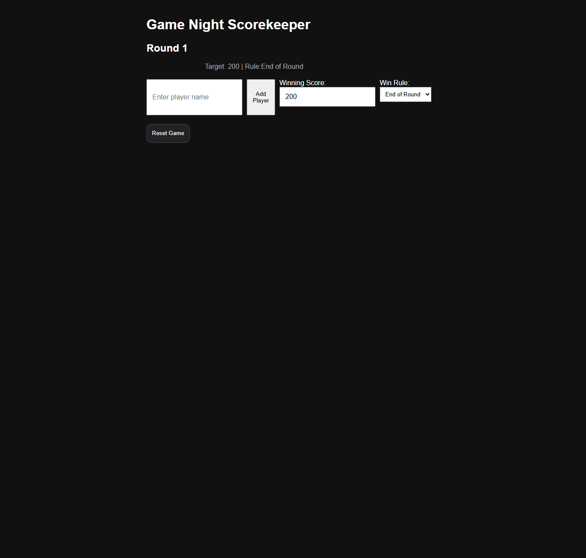
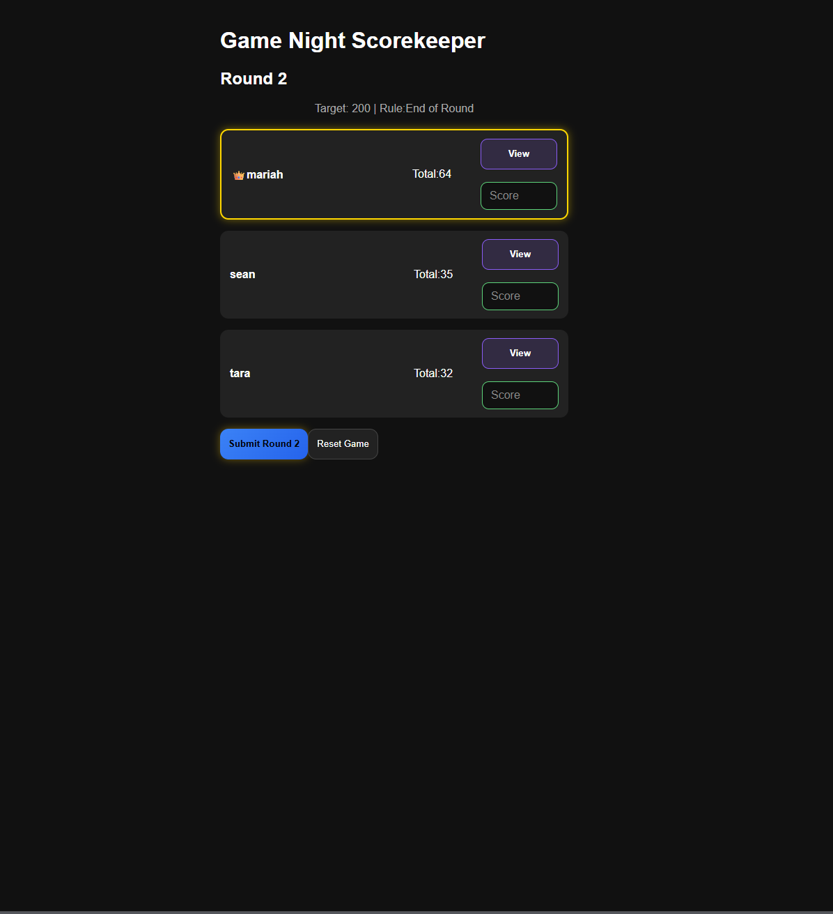
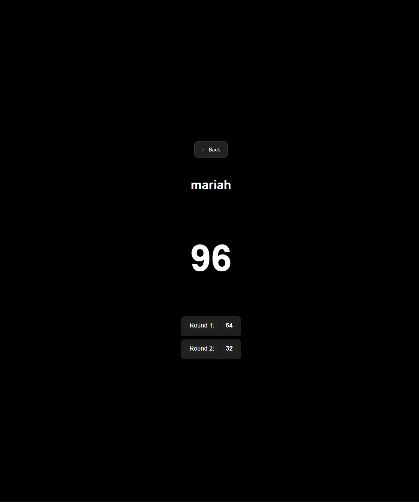

# Game Night Scorekeeper

A mobile-first scorekeeping app built with React for tracking scores during board games, card games, and game nights. Players can be added, reordered before starting, tracked across multiple rounds, and automatically ranked on a live leaderboard.

## Live Demo

https://game-night-scorekeeper.vercel.app

## GitHub Repository
https://github.com/tarajeter/game-night-repository

## Project Goals

This project was built to practice React state management while creating a real-world application that could be used during board game nights. The focus was on mobile usability, clean score tracking, and a fast interface that requires minimal taps during gameplay.

## Features

- Add and remove players
- Custom player order before starting a game
- Round-by-round score entry
- Automatic score totals
- Live leaderboard
- Winner highlighting
- Player detail screen
- Round history tracking
- Custom target score
- Mobile-friendly interface
- Dark mode UI

## Built with

- React
- JavaScript
- CSS
- Vercel

## Development Tools
- Git
- GitHub
- Visual Studio Code

## Screenshots

### Setup Screen

### Active Game

### Player History

## What I Learned

While building this project I practiced:

- React state management
- Array methods (map, reduce, sort)
- Conditional rendering
- Component styling
- Mobile-first UI design
- Data modeling
- Git and GitHub workflows
- Deployment with Vercel

## Future Improvements

- Multiplayer game rooms
- Real-time synchronization
- Shared scoreboards across devices
- Additional game modes
- Statistics and game history
